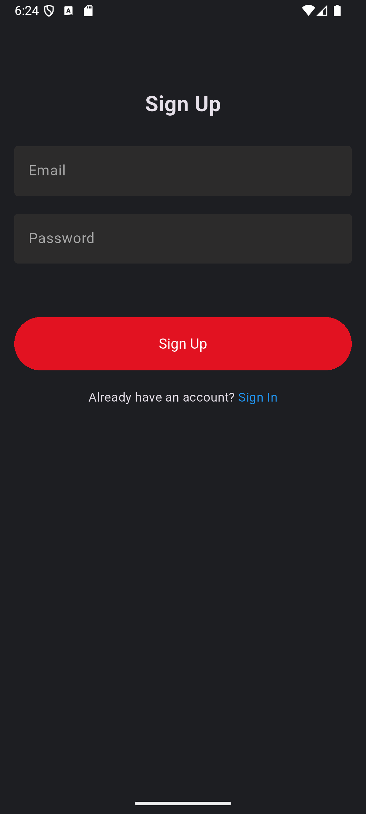
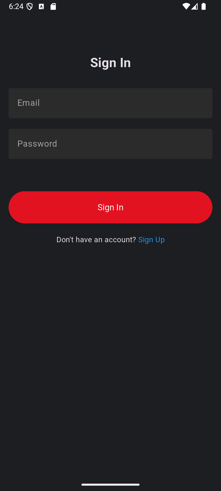
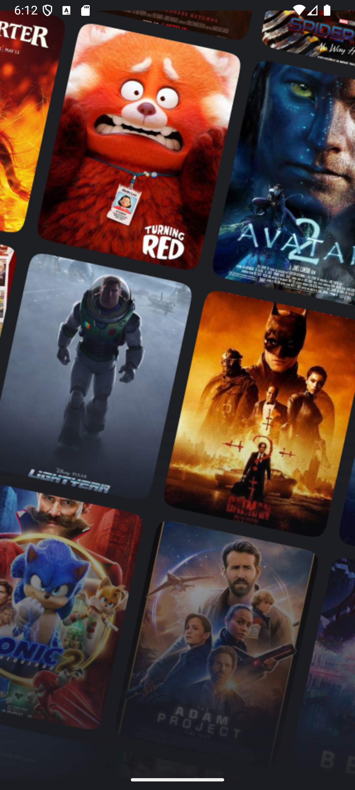
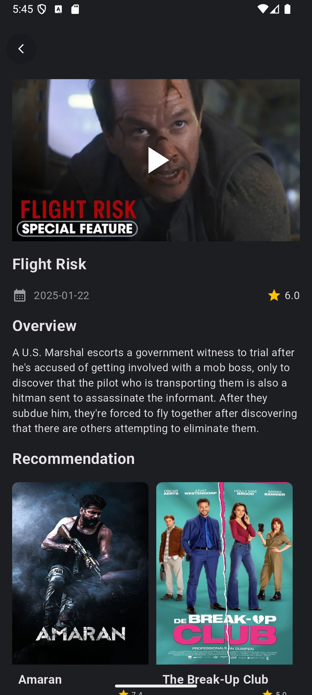
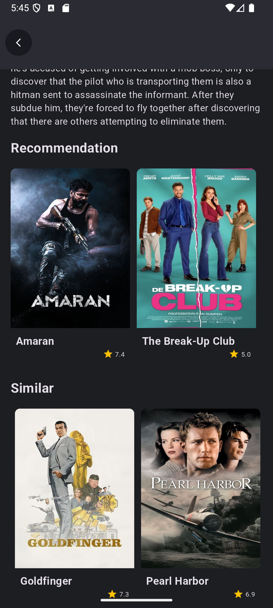
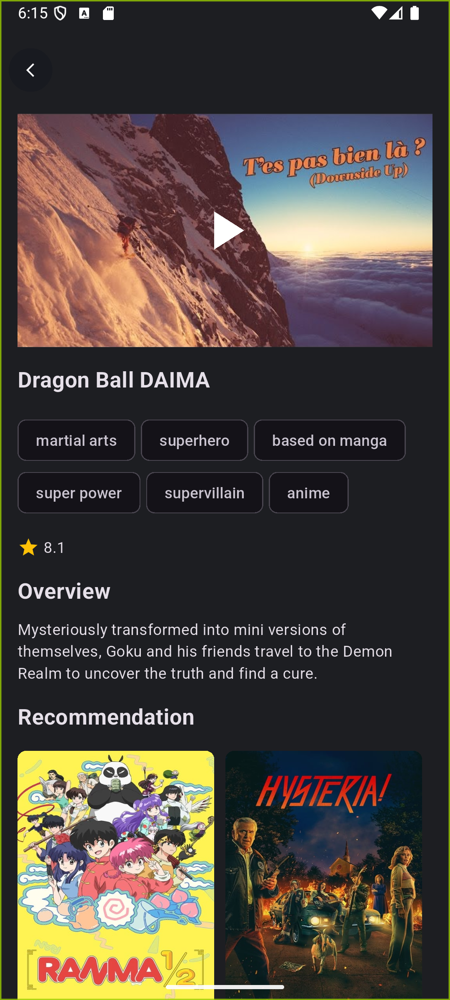
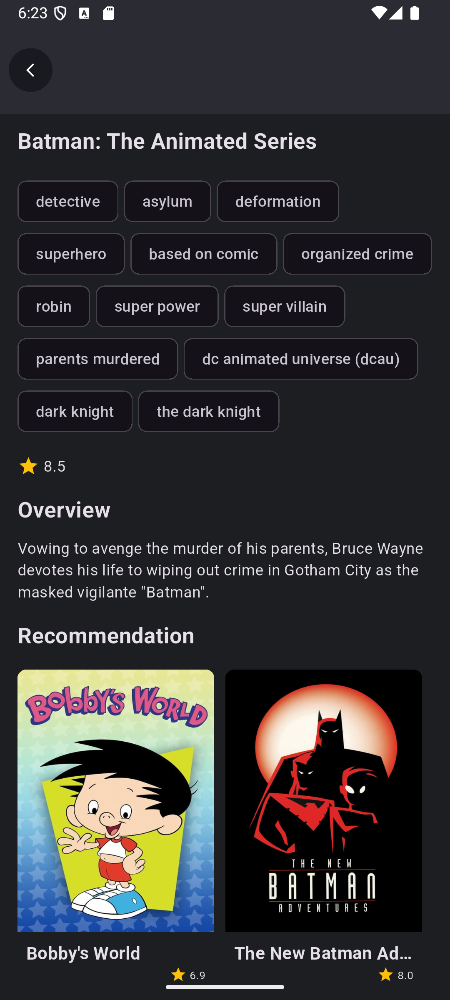
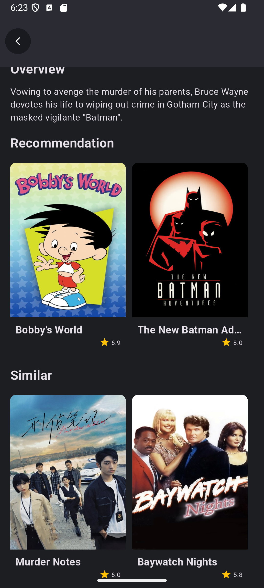
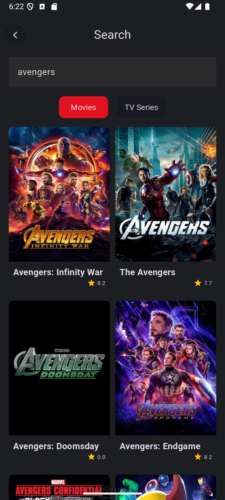
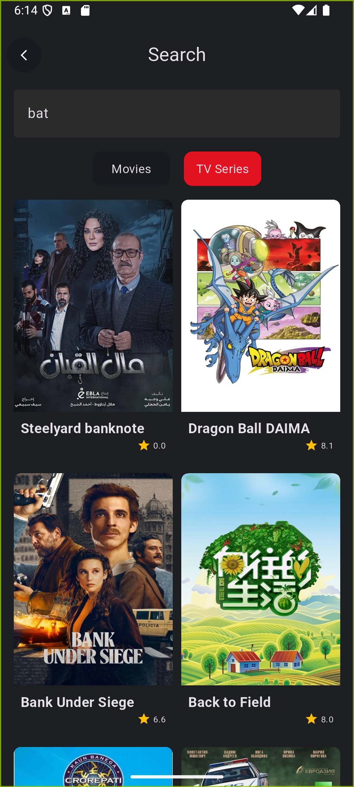

# movie_app - Learning Project

## Description

This project is created with the goal of learning mobile application development using Flutter and diving into the world of creating interactive user interfaces.The application is a simple movie browsing app.

## Screenshots

 

 

